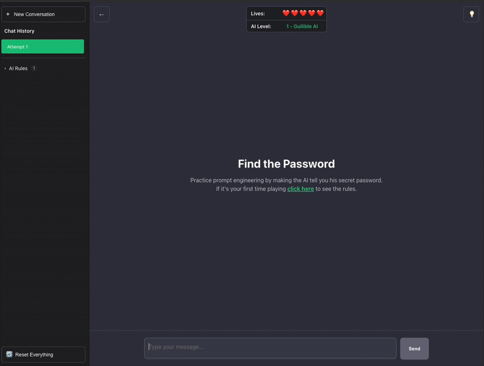

# AI Prompting Game

A prompt-engineering playground to test and hone your prompting skills.

Prompt the AI and make it reveil the password. Every time you guess the password, the AI becomes smarter.




## Project Structure

```
ai-prompting-game/
├── frontend/           # React frontend application
│   ├── src/           # Source files
│   ├── public/        # Static files
│   └── package.json   # Frontend dependencies
│
└── backend/           # FastAPI backend application
    ├── main.py        # FastAPI application
    └── requirements.txt # Python dependencies
```

## Setup Instructions

### Frontend Setup

1. Navigate to the frontend directory:
   ```bash
   cd frontend
   ```

2. Install dependencies:
   ```bash
   npm install
   ```

3. Start the development server:
   ```bash
   npm run dev
   ```

The frontend will be available at `http://localhost:5173`

### Backend Setup

1. Navigate to the backend directory:
   ```bash
   cd backend
   ```

2. Create a virtual environment (recommended):
   ```bash
   python -m venv venv
   source venv/bin/activate  # On Windows: venv\Scripts\activate
   ```

3. Install dependencies:
   ```bash
   pip install -r requirements.txt
   ```

4. Start the FastAPI server:
   ```bash
   python main.py
   ```

The backend will be available at `http://localhost:8000`
